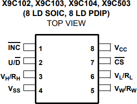
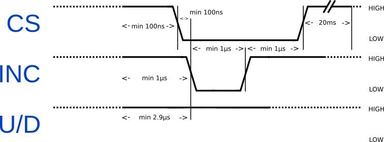
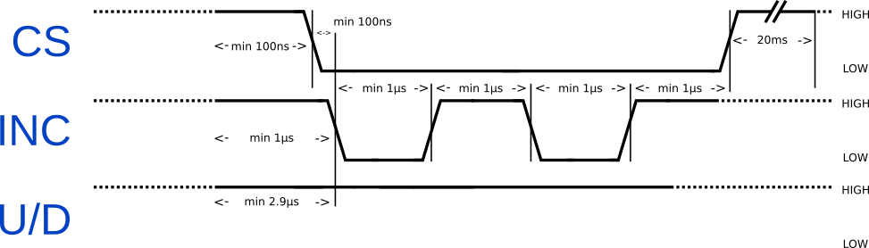
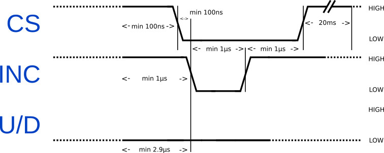
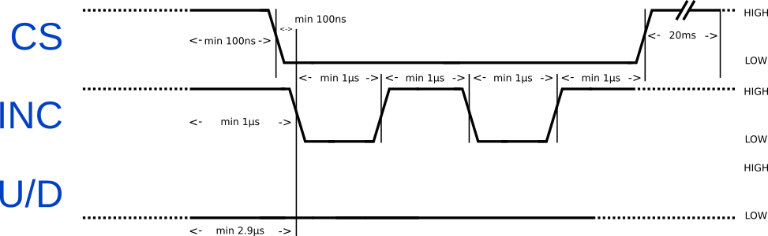
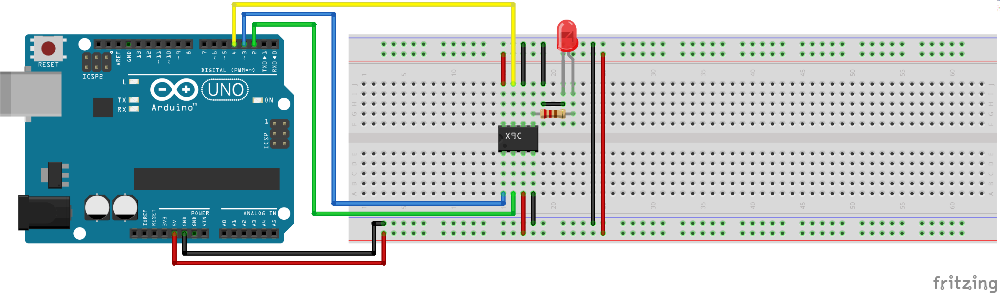

<p align="center">
  
</p>

The following repository contains a couple of my own notes regarding the X9C series digital potentiometer ICs by Renesas.

<!-- omit in toc -->
# Contents

- [Datasheet](#datasheet)
- [Description](#description)
- [Availability](#availability)
- [Pinout](#pinout)
- [Usage](#usage)
- [Driver](#driver)
- [Arduino](#arduino)

# Datasheet

The datasheet for the X9C series digital potentiometer ICs by Renesas is available [here](https://www.renesas.com/eu/en/www/doc/datasheet/x9c102-103-104-503.pdf).

# Description

The X9C ICs by Renesas are a series of digitally controllable potentiometers which are composed of 99 resistive elements and a wiper switching network. In total, the X9C series digital potentiometers provide a total 100 Wiper tap points.

The X9C series offers a total of 4 major models, each providing a different maximum resistance. The first two digits of the model number indicate the maximum resistance coefficient and the last number indicates the base 10 exponent.

|Model|Maximum Resistance (Ohms)|
|-----|-------------------------|
|X9C102|1k|
|X9C103|10k|
|X9C503|50K|
|X9C104|100k|

# Availability

The X9C series digital potentiometer ICs can be easily purchased from ebay, aliexpress, as well as mouser, digikey as well as plenty of local hardware stores, often in form of broken out "modules". 

# Pinout

<p align="center">
  
</p>

|Pin Number|Pin|Description|
|----------|---|-----------|
|1|INC|The INC input is negative-edge triggered. Toggling INC will move the wiper and either increment or decrement the counter in the direction indicated by the logic level on the U/D input.|
|2|U/D|The U/D input controls the direction of the wiper movement and whether the counter is incremented or decremented.|
|3|Vh/Rh|The high (Vh/Rh) terminals of the X9C102, X9C103, X9C104, X9C503 are equivalent to the fixed terminals of a mechanical potentiometer. The minimum voltage is -5V and the maximum is +5V. The terminology of VH/RH and Vl/Rl references the relative position of the terminal in relation to wiper movement direction selected by the U/D input and not the voltage potential on the terminal.|
|4|Vss|Negative Supply Voltage and/or Ground|
|5|Vw/Rw|VW/RW is the wiper terminal and is equivalent to the movable terminal of a mechanical potentiometer. The position of the wiper within the array is determined by the control inputs. The wiper terminal series resistance is typically 40.|
|6|Vl/Rl|The low (VL/RL) terminals of the X9C102, X9C103, X9C104, X9C503 are equivalent to the fixed terminals of a mechanical potentiometer. The minimum voltage is -5V and the maximum is +5V. The terminology of VH/RH and VL/RL references the relative position of the terminal in relation to wiper movement direction selected by the U/D input and not the voltage potential on the terminal.|
|7|CS|The device is selected when the CS (Chip Select) input is LOW. The current counter value is stored in non-volatile memory when CS is returned HIGH while the INC input is also HIGH. After the store operation is complete the X9C102, X9C103, X9C104, X9C503 device will be placed in the low power standby mode until the device is selected once again.|
8|Vcc|Positive Supply Voltage|

# Usage

The X9C series digital potentiometers provide a rather intuitive hardware interface that is much based on the way an ordinary mechanical potentiometer works.

The chip takes a recommended 5V supply voltage across the VCC and VSS pins. Analogously to the three terminals on a mechanical potentiometer, the X9C series digital potentiometers provides a high terminal, Vh, a low terminal, Vl, and a wiper terminal, Vw. Under DC conditions, current is meant (but is in no way limited) to flow from the high to the low terminal.

Adjusting the resistance is done incrementally by using the CS, U/D and INC pins. Because the resistance is only saved to memory upon a positive edge on the CS pin, and because an increase or decrease of resistance is toggled by a falling edge across the INC pin, we must first ensure that the CS and INC pins are set HIGH prior altering the resistance. To move the wiper up, that is, lower the resistance and increase the current, the U/D pin must first be set to HIGH. Then we select the device by setting CS to LOW and immediately proceed to increment the wiper by applying one or more LOW pulses across the INC pin. With every applied pulse, the wiper is moved by one position upwards. After the desired amount of pulses have been applied, the CS and INC pin must be raised back to high to save and apply the new wiper position.

Moving the wiper down, that is increase the resistance and lower the current, is done the exact same way as moving the wiper up, with the only difference being that the U/D pin must be set to low.

For the exact timing information, please refer to the following timing diagrams illustrating example cases:

<!-- omit in toc -->
Incrementing the wiper up by a single position
---


<!-- omit in toc -->
Incrementing the wiper up by two positions
---


<!-- omit in toc -->
Incrementing the wiper down by a single position
---


<!-- omit in toc -->
Incrementing the wiper down by two positions
---


# Driver

The section provides pseudocode that could be used to drive an X9C series digital potentiometer using a microcontroller. No assumptions are made regarding the speed of the host peripheral, meaning timing is explicitly taken into account.

For a practical implementation of this pseudocode, refer to the Arduino section below.

```
increment_wiper(up, positions)
    CS -> LOW;
    INC -> HIGH
    
    if up
        U/D -> HIGH
    else
        U/D -> LOW
    
    wait >= 2.9us
    
    for i = 0; i < positions; i++
        INC -> LOW
        wait >= 1us
        INC -> HIGH
        wait >= 1us

    CS -> HIGH

    wait >= 20ms
```

With slower microcontrollers, such as AVR chips commonly used in Arduinos, delays that require less than 1us are negligible.

# Arduino

To provide a practical example of the pseudocode above, I have written a simple Arduino library/class to drive X9C digital potentiometer ICs. All code can be found in the [Arduino directory](Arduino/) of this repository.

<!-- omit in toc -->
[x9c.h](Arduino/x9c.h)
---
```cpp
#pragma once

#include <Arduino.h>

class x9c
{
private:
    uint8_t inc;
    uint8_t cs;
    uint8_t ud;

    uint8_t wiper_pos;

public:
    x9c(uint8_t inc, uint8_t cs, uint8_t ud);
    void set(uint8_t pos);              // Sets wiper to any desired tap point between 0 and 99
    void increment(bool up, uint8_t n); // Increments/Moves wiper up or down by n positions
    uint8_t get_wiper_pos();            // Returns current tap point
};
```

<!-- omit in toc -->
[x9c.cpp](Arduino/x9c.cpp)
---
```cpp
#include "x9c.h"

x9c::x9c(uint8_t inc, uint8_t cs, uint8_t ud) : inc(inc), cs(cs), ud(ud)
{
    pinMode(inc, OUTPUT);
    pinMode(cs, OUTPUT);
    pinMode(ud, OUTPUT);
    
    // Since we cannot predict which tap point is used at initialization, 
    // we must assume the highest possible tap point (99) and move the
    //  wiper down by 99 positions!
    wiper_pos = 99;
    set(0);
}

void x9c::set(uint8_t pos)
{
    if (pos == wiper_pos)
    {
        return;
    }

    if (pos > 99)
    {
        pos = 99; // Pot only has 100 tap points!
    }

    digitalWrite(cs, LOW);
    digitalWrite(inc, HIGH);

    bool ud_state = (pos > wiper_pos); // Move wiper up if current wiper_pos < pos, otherwise move the wiper down!
    uint8_t n_pulses;

    if (ud_state)
    {
        n_pulses = pos - wiper_pos;
    }
    else
    {
        n_pulses = wiper_pos - pos;
    }

    digitalWrite(ud, ud_state);

    // 2.9 us delay negligible

    // Move wiper
    for (uint8_t i = 0; i < n_pulses; i++)
    {
        digitalWrite(inc, LOW);
        digitalWrite(inc, HIGH);
    }

    // Save/Apply wiper position to mem
    digitalWrite(cs, HIGH);
    delay(20);

    wiper_pos = pos;  
}

void x9c::increment(bool up, uint8_t n)
{
    if (n > 99)
    {
        n = 99;
    }

    if (up || (wiper_pos - n >= 0)) // Prevent underflow when incrementing wiper down
    {
        set(wiper_pos + (up ? n : -n));
    }
}

uint8_t x9c::get_wiper_pos()
{
    return wiper_pos;
}
```

The class exposes a total of three functions, `set(uint8_t pos)`, `increment(bool up, uint8_t n)`, `get_wiper_pos()`, as well as a constructor, which takes the `INC`, `CS` and `UD` pins as parameters.

---

**Instantation:**

Upon instantiation, the wiper is set to its lowest position (highest resistance). Since the Arduino has no way of telling what the potentiometers initial value is, we must assume the highest possible tap point (99) and move the wiper down by 99 positions.

---

**set(uint8_t pos)**

The `set(uint8_t pos)` function sets wiper to any desired tap point between 0 and 99.

---

**increment(bool up, uint8_t n)**

Increments the wiper position by n. Setting `up` to true will move the wiper up, setting `up` to false will move the wiper down. Should one attempt to move the wiper beyond its limits, then only as many pulses are emitted as required to reach the limit.

---

**get_wiper_pos()**

Returns the current wiper position

---

In the following example the brightness of an LED is swept (as demonstrated in the gif at the start of this README) by continuously incrementing the wiper upwards until the maximum wiper position is reached. Then the wiper is moved back to its lowest position.

The X9C chip is wired up as it follows:

|X9C Pin|Arduino Pin|
|-------|-----------|
|VCC|5V|
|VSS|GND|
|Vh/Rh|5V|
|Vl/Rl|GND|
|INC|3|
|U/D|2|
|CS|4|



Altough the X9C series potentiometers can only output a maximum of 4.4mA on the wiper pin, it doesn't hurt adding a current limiting resistor before the LED.

<!-- omit in toc -->
[Main.ino](Arduino/Main.ino)
---
```cpp
#include <Arduino.h>
#include "x9c.h"

void setup()
{
}

void loop()
{
  x9c x9c102(3, 4, 2);

  while(true)
  {
    // Sweep wiper up
    for (uint8_t i = 0; i < 99; i++) {
      x9c102.increment(true, 1);
      delay(50);
    }

    // Set wiper back to its lowest position
    x9c102.set(0);
    delay(50);    
  }
}
```
